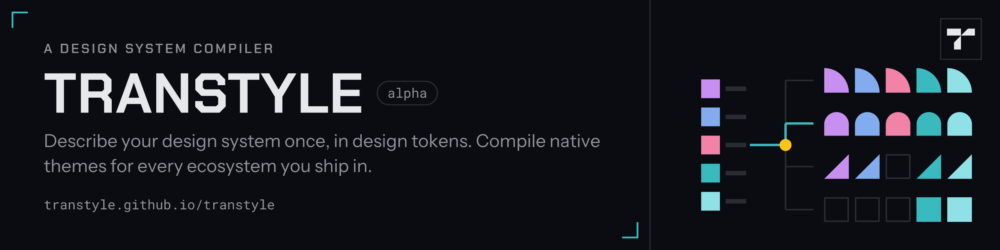
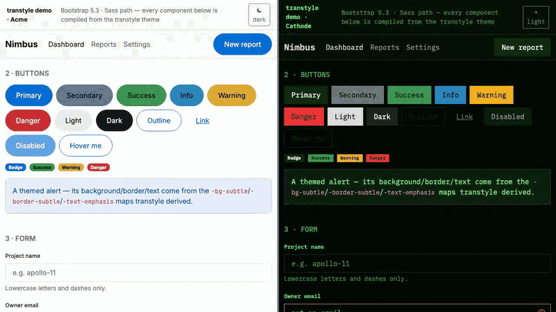

<p align="center"><a href="https://transtyle.github.io/transtyle/"><picture><source srcset=".github/header.svg" type="image/svg+xml"></picture></a></p>

<h1 align="center">Transtyle</h1>

<p align="center">
  <strong>A design system compiler.</strong><br>
  Describe your design system once, in design tokens.<br>
  Compile native themes for every ecosystem you ship in.
</p>

<p align="center">
  <a href="https://transtyle.github.io/transtyle/">Documentation</a> ·
  <a href="https://transtyle.github.io/transtyle/demo/">Live demos</a> ·
  <a href="https://www.npmjs.com/org/transtyle">npm</a> ·
  <a href="ROADMAP.md">Roadmap</a> ·
  <a href="VISION.md">Vision</a>
</p>

<p align="center"></p>

> [!WARNING]
> **Alpha — experimental.** Breaking changes ship without a deprecation cycle: token vocabulary,
> generated output, config format and CLI surface can each change between alpha releases. Pin an
> exact version, and treat generated files as disposable output you regenerate — never as something
> to hand-edit and keep. ([why](docs/adr/0010-pre-release-breaking-changes.md))

## The problem

"Our brand color is `#4f46e5`" is one decision. In a real product it lives in a Bootstrap Sass
variable, a `--primary` in shadcn's `globals.css`, a JSON key in an ECharts theme, and a knob in
Storybook's manager — maintained four times, by hand, and drifting apart from the day they are
written.

Transtyle makes it one input and many outputs:

```
tokens.json  ─────→  transtyle build  ─────→  dist/shadcn/globals.transtyle.css
your names,                                   dist/bootstrap/_variables.transtyle.scss
your values,                                  dist/echarts/theme.<name>-{light,dark}.json
plain DTCG JSON                               …one directory per target
                                                 + usage.md + report.json
```

Every output is an idiomatic file a developer of that framework would recognize. Nothing you ship
depends on Transtyle at runtime.

## Try it

```bash
npm install                 # link workspaces (compiler packages have zero external dependencies)
cd examples/acme
npx transtyle build         # compile every configured target
npx transtyle check         # the pipeline without emit: validation + contrast + coverage
```

Or in your own project:

```bash
npm i -D @transtyle/cli@alpha
npx transtyle init          # scaffold config + starter tokens
npx transtyle add bootstrap
npx transtyle build
```

## Targets

<!-- measured: exporters = 8 -->

Eight exporters ship today:

| Target                                                 | Emits                                                                 |
| ------------------------------------------------------ | --------------------------------------------------------------------- |
| [shadcn/ui](docs/specs/exporters/shadcn.md)            | `globals.css` — light + dark, both Tailwind eras                      |
| [Bootstrap](docs/specs/exporters/bootstrap.md)         | `_variables.scss` + `_maps.scss`, or the CSS-variable path            |
| [daisyUI](docs/specs/exporters/daisyui.md)             | two `@plugin "daisyui/theme"` blocks, light + dark, OKLCH             |
| [Apache ECharts](docs/specs/exporters/echarts.md)      | theme JSON, one per mode, with a derived series palette               |
| [Storybook](docs/specs/exporters/storybook.md)         | manager + preview theme                                               |
| [Radix](docs/specs/exporters/radix.md)                 | 12-step color scales + alpha variants, for Radix Themes or standalone |
| [PrimeNG](docs/specs/exporters/primeng.md)             | an Aura-based preset, severities and component archetypes             |
| [css-variables](docs/specs/exporters/css-variables.md) | plain custom properties — also the reference plugin implementation    |

The core knows nothing about any of them: every one is a plugin on the same public API, so a
third-party exporter is a package name in your config.

## How it works

The mental model is Babel's, or LLVM's:

```mermaid
%%{init: {"fontFamily": "ui-monospace, SFMono-Regular, Menlo, Consolas, monospace", "theme": "base", "flowchart": {"wrappingWidth": 480}, "themeVariables": {"dropShadow": "none", "darkMode": true, "background": "#0A0C11", "fontFamily": "ui-monospace, SFMono-Regular, Menlo, Consolas, monospace", "fontSize": "14px", "primaryColor": "#16181E", "primaryTextColor": "#E6E8EC", "primaryBorderColor": "#292C33", "secondaryColor": "#16181E", "tertiaryColor": "#0A0C11", "lineColor": "#3AB9BF", "textColor": "#E6E8EC", "clusterBkg": "#0A0C11", "clusterBorder": "#292C33", "titleColor": "#8F929A", "edgeLabelBackground": "#0A0C11"}}}%%
flowchart TB
  accTitle: Importers, the intermediate representation, exporters
  accDescr: Importers read DTCG token files, Figma variables and a Tailwind config into one normalized, derived, validated token graph, which exporters write out as Bootstrap Sass and CSS variables, shadcn/ui globals.css, an Apache ECharts theme JSON, and more targets.

  subgraph field[" "]
    direction TB
    subgraph front["IMPORTERS (FRONTENDS)"]
      direction TB
      dtcg["DTCG token files"]
      figma["Figma variables"]
      tw["Tailwind config"]
    end
    subgraph ir["INTERMEDIATE REPRESENTATION"]
      pivot["normalized, derived, validated token graph"]
    end
    subgraph back["EXPORTERS (BACKENDS)"]
      direction TB
      bs["Bootstrap (Sass + CSS vars)"]
      sh["shadcn/ui (globals.css)"]
      ec["Apache ECharts (theme JSON)"]
      more["&hellip;"]
    end
    dtcg --> pivot
    figma --> pivot
    tw --> pivot
    pivot --> bs
    pivot --> sh
    pivot --> ec
    pivot --> more
  end

  classDef empty fill:#0A0C11,stroke:#8F929A,stroke-dasharray:4 3,color:#8F929A
  linkStyle default stroke-width:1.5px,color:#8F929A
  style field fill:#0A0C11,stroke:#292C33
  class more empty
```



One source of truth in the middle, pluggable ends on either side — which is what makes
ecosystem-to-ecosystem translation (Bootstrap → shadcn/ui) a composition of parts rather than a
special feature. Importers are specced, not yet built; today the frontend is DTCG.

Four properties hold it up:

- **DTCG superset, not a proprietary format.** Sources are valid [W3C design tokens](https://design-tokens.github.io/community-group/format/) plus namespaced extensions, so Style Dictionary, Tokens Studio and Figma interoperate for free ([ADR-0002](docs/adr/0002-dtcg-superset-ir.md)).
- **Deterministic, explainable derivation.** You author the handful of decisions you actually made; every other slot is filled by inspectable rules. `transtyle explain <slot>` prints the chain that produced a value ([derivation](docs/architecture/derivation.md)).
- **Honest about lossiness.** Each build reports what mapped natively, what was derived, what was approximated, and what the target cannot express ([coverage](docs/specs/validation-and-coverage.md)).
- **Regeneration is byte-deterministic.** Same tokens, same files — so the output belongs in a build step, not in review.

## Examples

<!-- measured: examples = 4 -->

Four examples compile end to end, each with runnable demo projects under
`examples/<name>/demo/<target>/` that consume only the compiled output:

| Example                      | What it shows                                                                               |
| ---------------------------- | ------------------------------------------------------------------------------------------- |
| [Acme](examples/acme/)       | the ordinary case — a small brand, every target                                             |
| [Cathode](examples/cathode/) | a hostile one — a dark-native CRT system with its own vocabulary, bound by one-line aliases |
| [GOV.UK](examples/govuk/)    | a real published system, adopted without renaming anything                                  |
| [Carbon](examples/carbon/)   | IBM's, likewise — real values, real accessibility constraints                               |

All 32 of those demos (4 examples × 8 targets) are deployed and browsable:
**[transtyle.github.io/transtyle/demo](https://transtyle.github.io/transtyle/demo/)**. Within a
target the page is byte-identical across all four design systems — enforced in CI — so anything
that differs between them came out of the compiler. Each demo has a switcher in the corner for
jumping along either axis.

To run them locally instead:

```bash
npm run dev -w acme-demo-bootstrap     # the same page in real Bootstrap, port 4101
npm run dev -w acme-demo-shadcn        # …and in real shadcn/ui, port 4103
npm run dev -w cathode-demo-storybook  # a phosphor-green Storybook, port 6201

npm run demos:all                      # build all 32 + the site, exactly as deployed
```

## Status

`build`, `check`, `explain`, `init`, `add` and `diff` are implemented; `import`, `preview` and
version pinning are specced. The component tier — theming components, not just palettes — is live
on Bootstrap and PrimeNG. [ROADMAP.md](ROADMAP.md) is the authority on what is real versus planned;
[docs/findings/](docs/findings/) records what needed a judgment call.

## Documentation

User documentation is on the [website](https://transtyle.github.io/transtyle/) (`npm run site:dev`
to run it locally): getting started, concepts, configuration, CLI, exporter guides, diagnostics, a
guide to [driving Transtyle with AI agents](website/src/docs/ai-agents.md), and a
[blog](website/src/blog/). The site also serves `llms.txt` and every page as raw markdown.

Engineering documentation lives in [docs/](docs/):

| Area           | Documents                                                                                                                                                                                                                                                                    |
| -------------- | ---------------------------------------------------------------------------------------------------------------------------------------------------------------------------------------------------------------------------------------------------------------------------- |
| Why / what     | [VISION.md](VISION.md), [prior art](docs/prior-art.md), [naming](docs/naming.md)                                                                                                                                                                                             |
| Architecture   | [overview](docs/architecture/overview.md), [pipeline](docs/architecture/pipeline.md), [IR](docs/architecture/ir.md), [derivation](docs/architecture/derivation.md), [plugins](docs/architecture/plugins.md), [versioning](docs/architecture/versioning.md)                   |
| Specifications | [configuration](docs/specs/configuration.md), [CLI](docs/specs/cli.md), [validation & coverage](docs/specs/validation-and-coverage.md), [doc generation](docs/specs/doc-generation.md), [component layer](docs/specs/component-layer.md), [exporters](docs/specs/exporters/) |
| Decisions      | [docs/adr/](docs/adr/)                                                                                                                                                                                                                                                       |
| Process        | [CONTRIBUTING.md](CONTRIBUTING.md), [RELEASING.md](RELEASING.md)                                                                                                                                                                                                             |

## Naming

**Transtyle** (transpile × style): a source-to-source compiler for design systems, and the name says
so. Selection history and rejected candidates: [docs/naming.md](docs/naming.md).

## License

[MIT](LICENSE).
